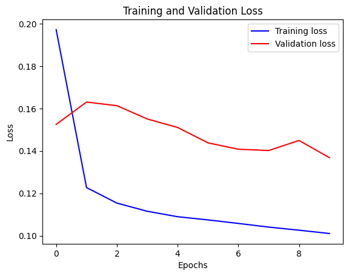

# Timeseries Project

Time Series Modeling with Deep Learning:  
- Classification using Transformer  
- Forecasting using LSTM

Course: *Deep Learning for Engineers (CMPE 401), University of British Columbia* 

Student: Elísa Inger Jónsdóttir 

Professor: Ling Bai

This project is based on two official Keras time-series examples:

- **Transformer Classification**  
  Keras: https://keras.io/examples/timeseries/timeseries_classification_transformer/  
  Colab: https://colab.research.google.com/github/keras-team/kerasio/blob/master/examples/timeseries/ipynb/timeseries_classification_transformer.ipynb  

- **LSTM Forecasting**  
  Keras: https://keras.io/examples/timeseries/timeseries_weather_forecasting/  
  Colab: https://colab.research.google.com/github/keras-team/kerasio/blob/master/examples/timeseries/ipynb/timeseries_weather_forecasting.ipynb  

---

# Reproducing the Baseline

## Transformer Classification

The Transformer was run for 150 epochs and resulted in a final evaluation of  
[0.6928 loss, 0.5159 accuracy], which is approximately equivalent to random guessing.

### Observations

- The training loss remained around **0.693**, which is the expected loss for a binary classification model making random predictions.
- The accuracy stayed close to **50–52%**, further confirming that the model did not learn meaningful patterns from the data.
- There was no noticeable improvement over epochs, indicating that the model failed to converge and indeed did stop early at epoch 45.
- Compared to the official Keras example (which achieves ~95% accuracy), this suggests that something in the training setup or data pipeline is not functioning as intended.

## LSTM Forecasting

The baseline LSTM model was successfully trained using the provided code.

### Observations
- Training loss decreases steadily, indicating that the model is learning.
- Validation loss also decreases but remains higher than training loss, suggesting mild overfitting.
- The model is able to capture general trends in the data but still leaves room for improvement.

### Baseline Results

| Metric | Value |
|--------|------|
| MSE    | 0.1375 |
| MAE    | 0.2912 |
| RMSE   | 0.3708 |
| R²     | 0.8336 |

### Visualizations

  

---

# Improving the Baseline Model

The LSTM forecasting model was improved using three modifications:

1. **Increased LSTM hidden size (32 → 64)**  
   Improves the model’s ability to capture complex temporal patterns.

2. **Added Dropout (0.2)**  
   Reduces overfitting by improving generalization.

3. **Changed input sequence length (past = 720 → 360)**  
   Allows the model to focus on more recent patterns while reducing noise.

### Improved Results

| Metric | Baseline Model | Improved Model |
|--------|----------------|----------------|
| MSE    | 0.1375         | 0.1290         |
| MAE    | 0.2912         | 0.2819         |
| RMSE   | 0.3708         | 0.3592         |
| R²     | 0.8336         | 0.8431         |

### Observations

- All error metrics decreased, indicating improved prediction accuracy.
- R² increased, showing better explanation of variance in the data.
- Improvements are consistent across all metrics, suggesting better generalization.

---

# Summary

The experiments show a clear progression:

- The **baseline model** provides a reasonable fit but shows mild overfitting.
- Increasing model capacity and adding dropout improves learning and generalization.
- Adjusting the input sequence length helps balance model complexity and noise.

### Key Takeaways

- Increasing model capacity improves performance.
- Regularization (dropout) helps reduce overfitting.
- Input sequence length is a critical factor in time-series modeling.
- Improvements are moderate but consistent, indicating a more robust model.

---

# Questions

### Which model did you find easier to understand and why?

I found that the LSTM forecasting model was easier to understand because its structure is straightforward and directly models temporal dependencies. The input-output relationship is intuitive, making it easier to interpret how changes in the architecture affect performance.

### What improvement did you try, and what did you learn from it?

The improvements tested were increasing the LSTM size, adding dropout, and modifying the input sequence length. These experiments showed that:
- Larger models can capture more complex patterns,
- Dropout helps prevent overfitting,
- The amount of historical data significantly impacts performance.

Overall, the experiments demonstrated that balancing model complexity and generalization is key to improving time-series predictions.

---
